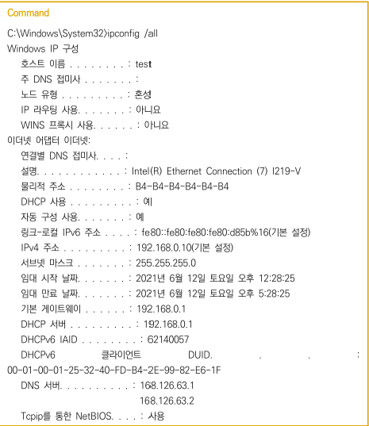
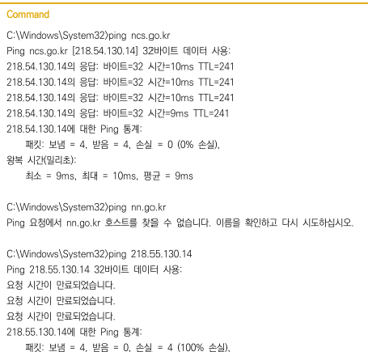
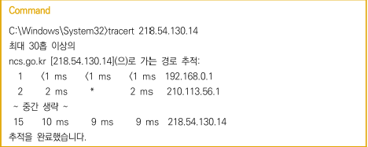

### 패킷 스위칭 시스템의 구조 파악
1. 학습자의 IP와 기본 라우터 정보 확인
- 명령어 처리기 실행
- ipconfig /all 실행하여 NIC 설정 정보 확인
> UNIX나 LINUX는 ifconfig
- IPv4 주소로 할당된 IP 정보 확인
- 기본 게이트웨이로 기본 라우터 IP 확인
> 목적지 IP가 라우터에 등록되지 않은 경우 기본으로 전송하는 라우터의 IP가 지정되어 있는 기본 게이트웨이를 확인

2. ping 명령어로 접속하고자 하는 IP 또는 URL 입력하여 접속 여부
- 정상이면 왕복 시간 표시, 비정상이면 호스트를 찾을 수 없거나 요청 시간 만료
> 이 경우 입력정보 잘못되었는지, 라우팅 경로의 모든 장비 연결상태 순차적 검사

3. 목적지 시스템까지 라우팅경로 확인하여 네트워크 상태 파악
- tracert 명령어로 접속하고자 하는 시스템까지 경유하는 라우터 확인
> UNIX나 LINUX는 traceroute
- 경로에 문제가 있거나 장애, 방화벽 정책에 의해 연결이 막혀 있는 경우 IP까지 도달 X

- 기본 게이트웨이가 0.0.0.0 이면 외부 네트워크와의 단절
- 네트워크의 그룹핑 현황을 알기 위해서는 서브넷 마스크도 중요
### 라우팅 알고리즘과 프로토콜 식별
라우팅 경로 설정의 상세 현황을 파악하여 라우팅 알고리즘과 프로토콜을 식별하기 위해 라우터에 접속하여 라우팅 테이블 조회
* 라우팅 테이블
라우터에 전달된 패킷이 목적지까지 전달되기 위해 거쳐야 하는 라우팅 경로를 관리하는 테이블로 관리자가 직접 입력하여 관리하거나 라우터 간에 정보를 공유하면서 상황에 따라 동적으로 재구성한닫
1. 라우팅 장비에 접속
> 라우팅 테이블에 접속하기 위해 라우터 또는 라우팅을 수행할 수 있는 멀티 레이어 스위치에 접근
2. 라우팅 테이블 조회하여 라우팅 알고리즘과 프로토콜 식별
> 라우터 장비의 제조사에 따라 라우팅 테이블을 조회하는 명령어가 다르므로 명령어(show ip route)를 확인하여 라우팅 테이블을 조회
### 응용소프트웨어 특성파악, 프로토콜 구별하여 적용
1. 응용소프트웨어 특성 파악
> 응용소프트웨어는 사용자 및 기획자의 목적에 맞도록 만든 시스템, 구현되어야 하는 기능들을 요구사항 명세서로 작성하니 요구사항 명세서를 분석하여 응용소프트웨어의 특성 파악
2. 요구사항 명세서 예시의 기능 구현을 위해 필요한 프로토콜을 파악
> 네트워크 구간의 암호화 적용을 위해 HTTPS 프로토콜 파악하거나, 메일 발송 위해 SMTP 파악, 파일 서버 전송 위해 FTP 파악

